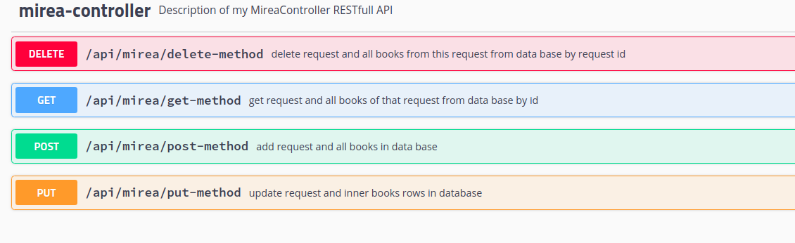

# MireaWebService
Тестовое приложение для введения в интеграции

## Функционал
4 канонических http метода : put, delete, post, get,
для взаимодействия с базой данных.



## Установка
```bash
git clone https://github.com/UBERMENSCH-numbers/MireaWebService
```

