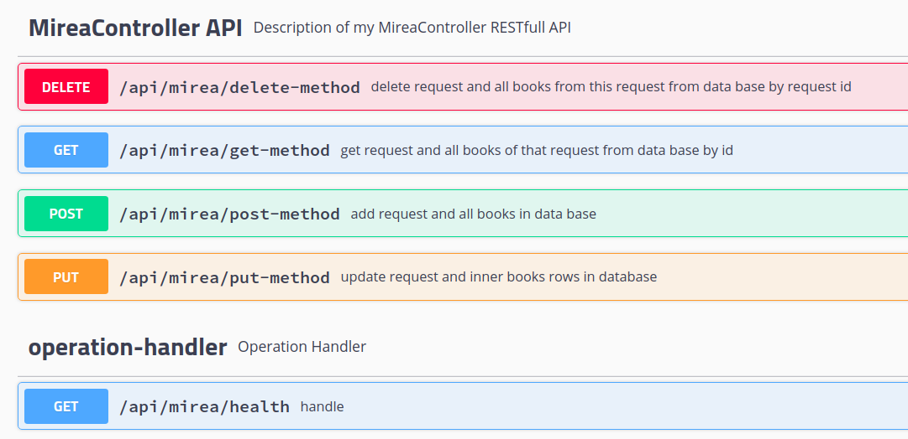

# MireaWebService
Тестовое приложение для введения в интеграции

## Функционал
Стандартные PUT, POST, GET, DELETE методы для работы с базой данных;
*/health для проверки работоспособности.



## Пример вызова 

### api/mirea/post-method request:
```json
{
  "bookTOList": [
    {
      "author": "author_1",
      "id": 1,
      "name": "name_1"
    },
    {
      "author": "author_2",
      "id": 2,
      "name": "name_2"
    }
  ],
  "id": 1,
  "requestValue": "test_call"
}
```


### api/mirea/post-method response:
```json
{
  "meta": {
    "code": 0,
    "description": "All good!"
  },
  "dataBlock": {
    "id": 1,
    "requestValue": "test_call",
    "bookTOList": [
      {
        "id": 117,
        "author": "author_2",
        "name": "name_2"
      },
      {
        "id": 116,
        "author": "author_1",
        "name": "name_1"
      }
    ]
  }
}
```
---------------
### api/mirea/get-method request:

```http request
http://localhost:8080/api/mirea/get-method?id=1
```

### api/mirea/get-method response:

```json
{
  "meta": {
    "code": 0,
    "description": "All good!"
  },
  "dataBlock": {
    "id": 1,
    "requestValue": "test_call",
    "bookTOList": [
      {
        "id": 117,
        "author": "author_2",
        "name": "name_2"
      },
      {
        "id": 116,
        "author": "author_1",
        "name": "name_1"
      }
    ]
  }
}
```
--------
### api/mirea/health request:

```http request
http://localhost:8080/api/mirea/health
```
### api/mirea/health response:
```json
{"status":"UP"}
```


## Установка
```bash
git clone https://github.com/UBERMENSCH-numbers/MireaWebService
```

